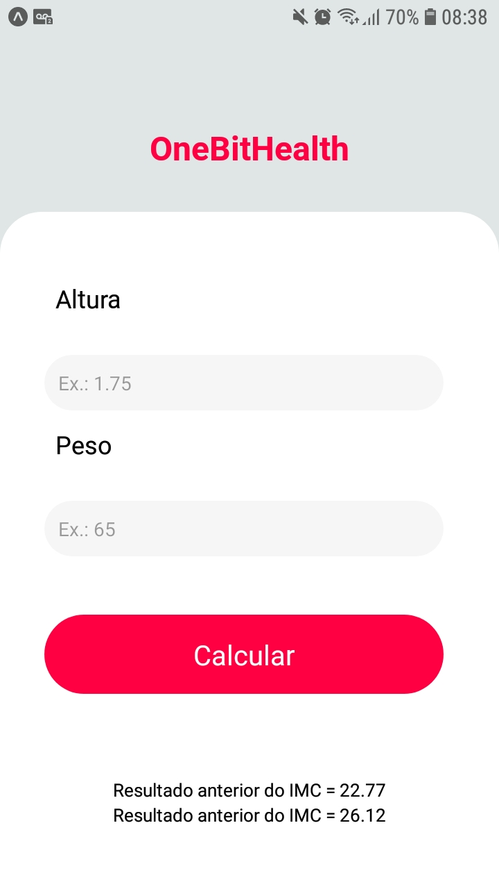
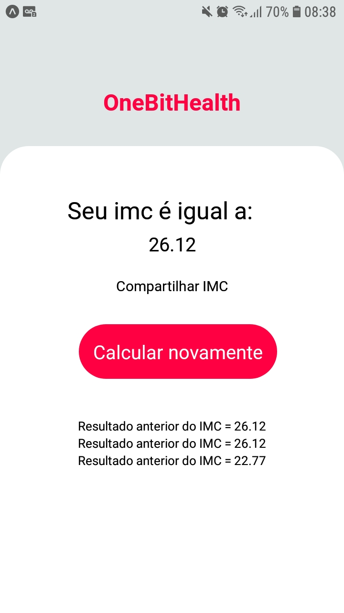

# onebithealth
A mobile app project made with React Native.

### Final Result

## 🚀 Starting

To start the project, just type `npm start` and then you are going to scan the QR CODE to start the project on Expo.

---
##### This project was made with the help of One Bit Code's tutorial on Youtube.
##### Youtube link: https://youtube.com/playlist?list=PLdDT8if5attEd4sRnZBIkNihR-_tE612_
